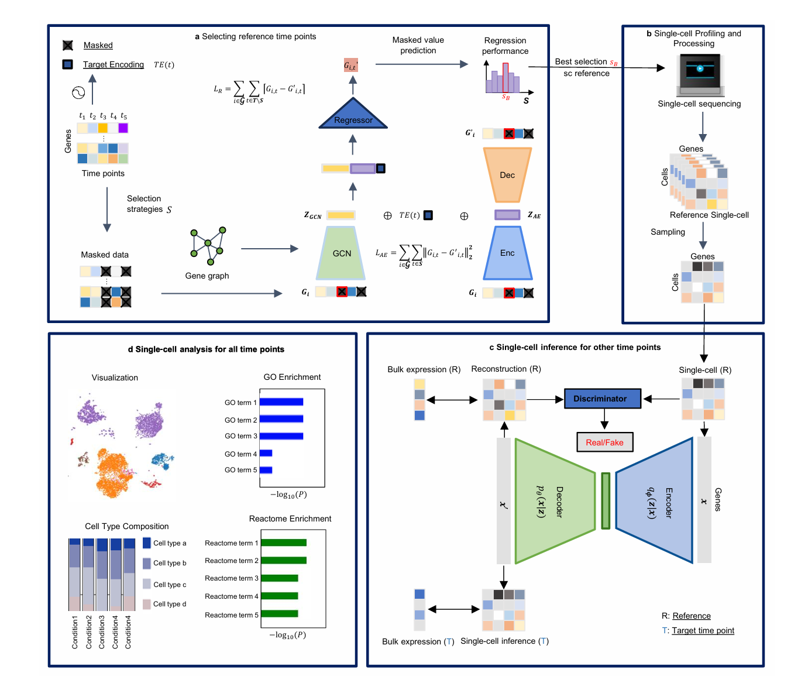

# 🧬 **TEMPO: Temporal Expression Model for Profiling and Optimization**  
**Deep Learning Framework for Optimal Time-Point Selection and Semi-Profiling in Time-Series Single-Cell Studies**

  
*Fig. 1 — Overview of the TEMPO framework*


## 📘 Overview

**TEMPO** (Temporal Expression Model for Profiling and Optimization) is a deep learning framework for **optimal time-point selection** and **semi-profiling of time-series single-cell datasets**.  
It builds upon and generalizes the earlier DTPSP framework with:

- A modular encoder–GCN–regressor neural architecture  
- A comprehensive beam-search strategy for optimal time-point selection  
- A clean Python API (`tempo_sc`) packaged for reproducibility  
- Support for single-cell profiling and inference (semi-profiling)

TEMPO addresses a central challenge in time-series biology:

> **How can we choose the most informative time points to collect single-cell data, while accurately inferring the missing ones?**


---

## 🔍 Method Summary

### **a. Reference time-point selection**
Given bulk or pseudobulk gene expression across **T** time points:

1. A **beam search** explores candidate subsets of time points \( S \)
2. For each subset, a deep model predicts non-selected time points
3. Input features include:
   - Masked gene expression  
   - **Autoencoder latent embeddings**  
   - **Graph Convolutional Network (GCN)** neighborhood embeddings  
   - **Sinusoidal positional embeddings (PE)** for time
4. The best subset \( S_B \) is selected according to validation MAE/R².

---

### **b. Single-cell profiling at selected time points**
Cells are sequenced *only* at \( S_B \), reducing cost while preserving key biological dynamics.

Standard single-cell QC and processing (Scanpy) follow.

---

### **c. Single-cell inference at unmeasured time points**  
A generative model (e.g., VAE-GAN) learns from real scRNA-seq at \( S_B \) and bulk trajectories, enabling **semi-profiling**:

- Single-cell matrices are inferred for unmeasured time points  
- A complete temporal single-cell atlas is produced

---

### **d. Downstream analysis**
With full single-cell data available across all times, users can perform:

- Temporal trajectory visualization  
- Differential expression  
- Pseudotime inference  
- Pathway enrichment  
- Temporal deconvolution  
- Multi-omics integration  

---


## 🎯 Key Features

### **1. Optimal time-point selection**
Maximizes information captured across a temporal study while minimizing profiling cost.

### **2. Improved neural architecture**
Combines:
- Masked autoencoder
- GCN layer for gene topology
- Deep regressor
- Joint fine-tuning
- Positional embeddings

### **3. Scalable**
Works for:
- Bulk RNA-seq  
- Pseudobulk (single-cell aggregated)  
- Microarray or temporal proteomics  

### **4. Semi-profiling of missing time points**
Generates realistic single-cell matrices for unmeasured time points.

### **5. Fully packaged and reproducible**
Installable with `pip` directly from PyPI.

---

## 📦 Installation

### **Install the latest version**
```bash
pip install tempo-sc
